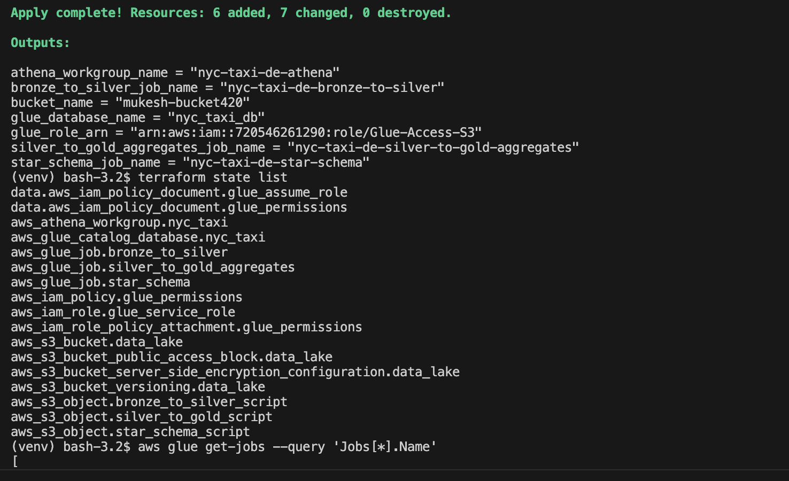
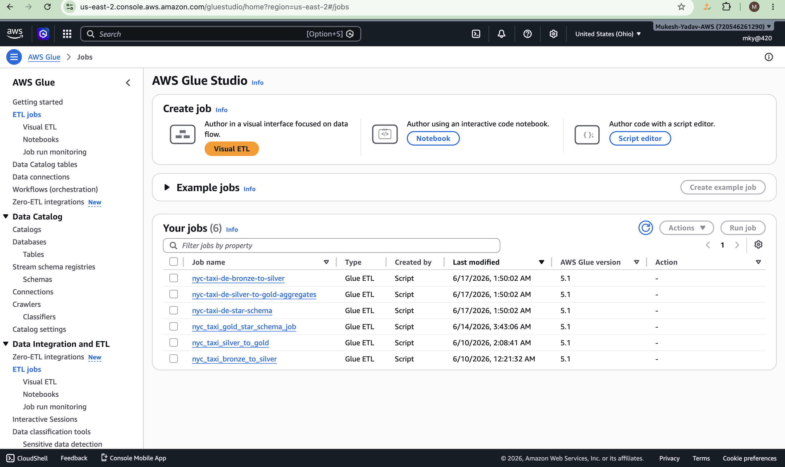
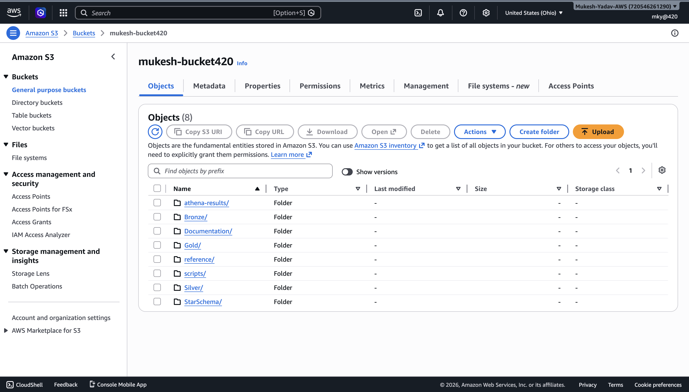
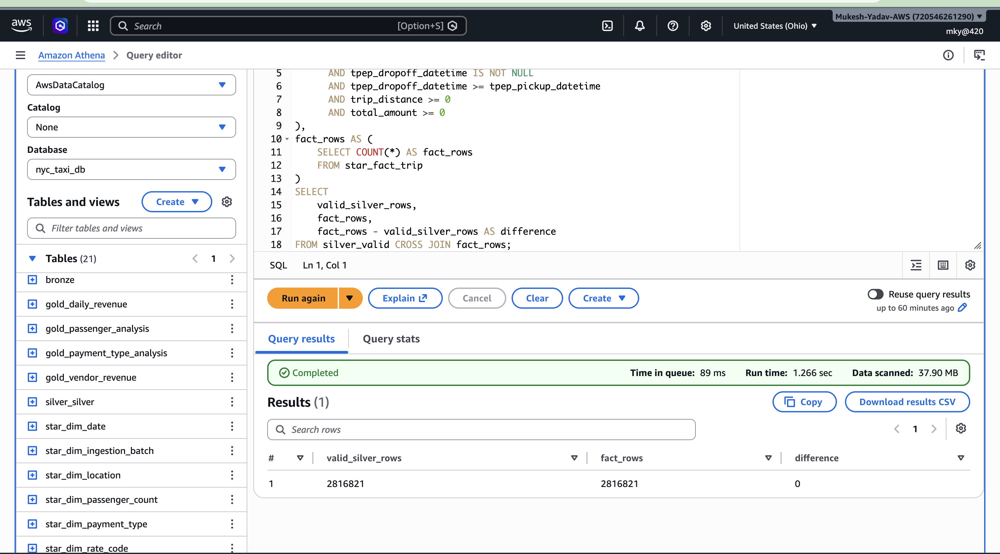
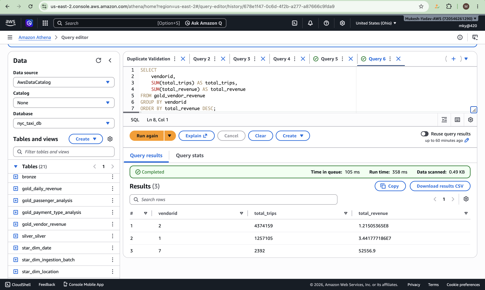
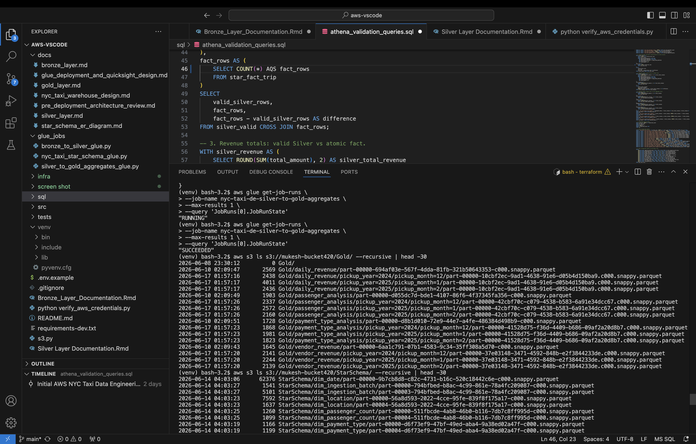

# AWS NYC Taxi Data Engineering Portfolio Project

This repository implements an AWS data engineering pipeline for NYC Yellow Taxi data using a Medallion Architecture and a dimensional warehouse model.

```text
NYC TLC Parquet
  -> S3 Bronze raw landing
  -> AWS Glue Silver cleansing
  -> AWS Glue Gold aggregate marts
  -> AWS Glue Star Schema warehouse
  -> Athena / BI
```

## Architecture

- Storage: Amazon S3
- Processing: AWS Glue PySpark
- Catalog: AWS Glue Data Catalog
- Query: Amazon Athena
- Dataset: NYC TLC Yellow Taxi Parquet data
- Modeling: Bronze, Silver, Gold, plus Kimball-style Star Schema

## Repository Structure

```text
src/bronze/
  ingest_tlc_taxi.py

glue_jobs/
  bronze_to_silver_glue.py
  silver_to_gold_aggregates_glue.py
  nyc_taxi_star_schema_glue.py

sql/
  athena_star_schema_ddl.sql
  athena_validation_queries.sql

tests/
  test_bronze.py
  test_silver.py
  test_gold.py

infra/terraform/
  main.tf
  variables.tf
  outputs.tf
  versions.tf

docs/
  bronze_layer.md
  silver_layer.md
  gold_layer.md
  nyc_taxi_warehouse_design.md
  star_schema_er_diagram.md
  glue_deployment_and_quicksight_design.md
```

## S3 Layout

Use your own bucket when deploying.

```text
s3://<bucket>/Bronze/yellow_tripdata/
s3://<bucket>/Silver/yellow_tripdata/
s3://<bucket>/Gold/
s3://<bucket>/StarSchema/
s3://<bucket>/scripts/
s3://<bucket>/temp/glue/
```

## 1. Ingest Bronze Data

The Bronze script downloads a public NYC TLC Yellow Taxi Parquet file and uploads the raw file unchanged.

```bash
python src/bronze/ingest_tlc_taxi.py \
  --bucket <bucket> \
  --year 2025 \
  --month 1
```

This creates:

```text
s3://<bucket>/Bronze/yellow_tripdata/year=2025/month=01/yellow_tripdata_2025-01.parquet
```

The script uses boto3 default credential resolution. Do not commit AWS credentials.

## 2. Run Bronze To Silver Glue Job

Upload the script:

```bash
aws s3 cp glue_jobs/bronze_to_silver_glue.py \
  s3://<bucket>/scripts/bronze_to_silver_glue.py
```

Create the Glue job:

```bash
aws glue create-job \
  --name nyc_taxi_bronze_to_silver \
  --role <glue-service-role> \
  --glue-version 4.0 \
  --worker-type G.1X \
  --number-of-workers 4 \
  --command 'Name=glueetl,ScriptLocation=s3://<bucket>/scripts/bronze_to_silver_glue.py,PythonVersion=3' \
  --default-arguments '{
    "--job-language": "python",
    "--BRONZE_INPUT_PATH": "s3://<bucket>/Bronze/yellow_tripdata/",
    "--SILVER_OUTPUT_PATH": "s3://<bucket>/Silver/yellow_tripdata/",
    "--enable-metrics": "true",
    "--enable-continuous-cloudwatch-log": "true",
    "--TempDir": "s3://<bucket>/temp/glue/"
  }'
```

Start the job:

```bash
aws glue start-job-run --job-name nyc_taxi_bronze_to_silver
```

## 3. Run Silver To Gold Aggregate Glue Job

Upload the script:

```bash
aws s3 cp glue_jobs/silver_to_gold_aggregates_glue.py \
  s3://<bucket>/scripts/silver_to_gold_aggregates_glue.py
```

Create the Glue job:

```bash
aws glue create-job \
  --name nyc_taxi_silver_to_gold_aggregates \
  --role <glue-service-role> \
  --glue-version 4.0 \
  --worker-type G.1X \
  --number-of-workers 4 \
  --command 'Name=glueetl,ScriptLocation=s3://<bucket>/scripts/silver_to_gold_aggregates_glue.py,PythonVersion=3' \
  --default-arguments '{
    "--job-language": "python",
    "--SILVER_INPUT_PATH": "s3://<bucket>/Silver/yellow_tripdata/",
    "--GOLD_OUTPUT_PATH": "s3://<bucket>/Gold/",
    "--enable-metrics": "true",
    "--enable-continuous-cloudwatch-log": "true",
    "--TempDir": "s3://<bucket>/temp/glue/"
  }'
```

Start the job:

```bash
aws glue start-job-run --job-name nyc_taxi_silver_to_gold_aggregates
```

## 4. Run Star Schema Glue Job

The Star Schema job builds dimensions, `fact_trip`, and aggregate fact tables from Silver.

```bash
aws s3 cp glue_jobs/nyc_taxi_star_schema_glue.py \
  s3://<bucket>/scripts/nyc_taxi_star_schema_glue.py
```

Recommended arguments:

```text
--DATABASE_NAME=nyc_taxi_db
--SILVER_TABLE_NAME=<silver_catalog_table>
--OUTPUT_BASE=s3://your-bucket/StarSchema/
--LOCATION_LOOKUP_PATH=s3://your-bucket/Reference/taxi_zone_lookup.csv
```

`--OUTPUT_BASE` is required. The Star Schema job does not provide a default output path because executable Glue code should not contain placeholder S3 locations.

If you use direct S3 reads for Silver, adapt the existing star schema job or register the Silver path in the Glue Data Catalog first.

## 5. Query With Athena

Use:

```text
sql/athena_star_schema_ddl.sql
sql/athena_validation_queries.sql
```

The current DDL uses explicit external tables over Parquet locations. For a production-grade lakehouse, use Apache Iceberg tables for ACID writes, schema evolution, compaction, and partition metadata management.

## Data Quality

Silver applies baseline trip validity rules:

- `passenger_count` is present and greater than zero.
- `trip_distance`, `fare_amount`, and `total_amount` are greater than zero.
- Pickup and dropoff timestamps are present.
- Dropoff time is not before pickup time.
- Duplicate rows are removed.

Gold aggregate outputs can be reconciled against Silver using row counts and revenue totals.

## Security

- No AWS credentials are committed.
- `.env` is ignored.
- Scripts use AWS CLI or boto3 default credential resolution.
- Replace `<bucket>` and `<glue-service-role>` with your own AWS resources.

## Portfolio Notes

This project demonstrates:

- S3-based medallion architecture.
- Glue PySpark ETL.
- Athena external table design.
- Star schema modeling with facts and dimensions.
- Data quality filtering and validation queries.
- Separation of raw, curated, aggregate, and dimensional layers.

Production improvements would include Step Functions or Airflow orchestration, CI/CD, Iceberg tables, automated data quality checks, structured logging, monitoring, and audit/reject tables.

## Project Screenshots

### Terraform Infrastructure Deployment



This screenshot demonstrates the Terraform workflow used to provision the AWS data platform. It shows that the infrastructure can be deployed repeatably through code instead of relying on manual AWS console configuration.

### AWS Glue Jobs Overview



This view highlights the AWS Glue jobs that run the PySpark ETL pipeline. It demonstrates the managed batch processing layer responsible for moving data through the Bronze, Silver, Gold, and Star Schema stages.

### S3 Data Lake Structure



This screenshot shows the S3 layout used for the lakehouse. The folder structure separates raw, cleansed, aggregated, and dimensional data so the pipeline remains easy to validate, operate, and explain in technical interviews.

### Star Schema Validation



This validation view confirms that the curated pipeline output supports an analytics-ready dimensional model. The Star Schema design makes the project relevant to data warehouse use cases and business intelligence workloads.

### Gold Vendor Revenue Analysis



This screenshot connects the Gold layer to a business-facing analytical question: vendor revenue performance. It demonstrates how Athena can query curated S3 data directly for KPI-style analysis without a separate database server.

### Project Code Structure



This screenshot shows the project organization across ingestion code, Glue jobs, SQL, tests, documentation, and Terraform. A clean repository structure helps recruiters and technical hiring managers quickly understand the engineering scope and maintainability of the project.

## Tests

Install local test dependencies:

```bash
python -m pip install -r requirements-dev.txt
```

Run tests:

```bash
python -m pytest tests -q
```

The Bronze tests validate ingestion path construction. The Silver and Gold tests use a local PySpark session to validate transformation and aggregation logic.

## Terraform

Terraform files are in:

```text
infra/terraform/
```

Deploy core AWS resources:

```bash
cd infra/terraform
terraform init
terraform plan -var='bucket_name=<globally-unique-bucket-name>'
terraform apply -var='bucket_name=<globally-unique-bucket-name>'
```

Terraform creates the S3 bucket, Glue database, Glue jobs, Glue IAM role, and Athena workgroup. Upload Glue scripts to the configured `scripts/` S3 keys before starting the jobs.
