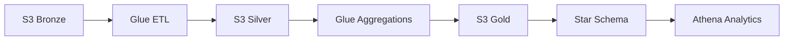

# NYC Taxi Data Engineering Lakehouse on AWS


## Project Overview

This project demonstrates a production-style cloud data engineering pipeline for NYC Taxi trip analytics. It uses AWS S3 as a data lake, AWS Glue and PySpark for ETL, Athena for serverless analytics, and Terraform for repeatable Infrastructure as Code.

The pipeline follows a Bronze/Silver/Gold lakehouse architecture and transforms raw taxi trip data into curated analytical datasets and a Star Schema model. The result is a recruiter-friendly, interview-ready data platform that highlights scalable batch processing, cloud-native orchestration, data quality validation, and dimensional modeling.

## Architecture

The platform is designed around clear separation of storage layers, transformation jobs, and analytics access. Terraform provisions the core AWS resources, AWS Glue executes PySpark transformations, S3 stores each lakehouse layer, and Athena provides SQL access for validation and analysis.



Provisioned infrastructure includes:

- S3 data lake bucket
- Glue Data Catalog database
- IAM role and policy for Glue jobs
- Bronze to Silver Glue job
- Silver to Gold aggregate Glue job
- Star Schema Glue job
- Athena workgroup

## Technology Stack

| Category | Technologies |
| --- | --- |
| Cloud Platform | AWS |
| Storage | AWS S3 |
| ETL Processing | AWS Glue, PySpark |
| Analytics | Amazon Athena, Glue Data Catalog |
| Infrastructure | Terraform, AWS IAM |
| Data Modeling | Star Schema, fact and dimension tables |
| Architecture Pattern | Bronze/Silver/Gold Lakehouse Architecture |
| Validation | Data quality checks, schema validation, Athena queries |

## Data Pipeline Flow

1. Raw NYC Taxi trip data lands in the S3 Bronze layer.
2. AWS Glue runs PySpark transformations to clean, standardize, and write curated data to S3 Silver.
3. A second Glue job creates analytical aggregates in the S3 Gold layer.
4. A Star Schema Glue job structures curated data into dimensional tables for analytics.
5. Athena queries the Glue Data Catalog and validates the final datasets.

## Bronze Layer

The Bronze layer stores raw taxi trip data in S3 with minimal transformation. This layer preserves source-level data for traceability, replay, and debugging.

In this project, the Bronze path is configured as:

```text
s3://<bucket>/Bronze/yellow_tripdata/
```

## Silver Layer

The Silver layer contains cleaned and standardized trip data produced by the Bronze to Silver Glue job. PySpark is used to prepare the data for downstream analytics by enforcing structure and improving query readiness.

In Terraform, the Silver output path is configured as:

```text
s3://<bucket>/Silver/yellow_tripdata/
```

## Gold Layer

The Gold layer contains business-ready aggregates generated from the Silver layer. These outputs are designed for analytics use cases such as revenue analysis, vendor performance, and trip-level KPI reporting.

In Terraform, the Gold output path is configured as:

```text
s3://<bucket>/Gold/
```

## Star Schema

The Star Schema layer models the curated taxi data for analytical querying. This structure supports common data warehouse patterns by separating business events from descriptive dimensions.

The Star Schema Glue job writes dimensional model outputs to:

```text
s3://<bucket>/StarSchema
```

This modeling approach demonstrates practical experience with analytics engineering concepts, including dimensional modeling, fact tables, dimension tables, and query-optimized datasets.

## Data Quality Validation

Data quality validation is a core part of the project. The pipeline is designed to support checks across schema consistency, curated layer outputs, Star Schema integrity, and Athena query results.

Validation activities include:

- Confirming Bronze, Silver, Gold, and Star Schema S3 paths are populated as expected.
- Verifying Glue jobs complete successfully and write outputs to the correct locations.
- Using Athena to inspect transformed datasets and validate analytical results.
- Checking Star Schema outputs for query readiness and business usability.

## Infrastructure as Code (Terraform)

Terraform provisions the AWS resources required by the NYC Taxi data engineering pipeline. The configuration creates the S3 data lake bucket, Glue Data Catalog database, Glue service IAM role and policy, Glue ETL jobs, uploaded Glue scripts, and Athena workgroup.

### Terraform Resources

| Resource | Purpose |
| --- | --- |
| `aws_s3_bucket.data_lake` | Central S3 bucket for Bronze, Silver, Gold, scripts, temp files, and Athena results |
| `aws_glue_catalog_database.nyc_taxi` | Metadata catalog for Glue and Athena |
| `aws_iam_role.glue_service_role` | IAM role assumed by AWS Glue |
| `aws_iam_policy.glue_permissions` | S3, Glue Catalog, and CloudWatch Logs permissions |
| `aws_glue_job.bronze_to_silver` | PySpark ETL from Bronze to Silver |
| `aws_glue_job.silver_to_gold_aggregates` | PySpark aggregations from Silver to Gold |
| `aws_glue_job.star_schema` | PySpark job that builds the Star Schema outputs |
| `aws_athena_workgroup.nyc_taxi` | Athena workgroup with encrypted S3 query results |

### Deployment

Terraform uploads the Glue scripts from the project-level `glue_jobs/` directory into the S3 data lake bucket:

```text
../../glue_jobs/bronze_to_silver_glue.py
../../glue_jobs/silver_to_gold_aggregates_glue.py
../../glue_jobs/nyc_taxi_star_schema_glue.py
```

Deploy the infrastructure:

```bash
cd infra/terraform
terraform init
terraform plan -var='bucket_name=<globally-unique-bucket-name>'
terraform apply -var='bucket_name=<globally-unique-bucket-name>'
```

If scripts need to be uploaded manually, use:

```bash
aws s3 cp glue_jobs/bronze_to_silver_glue.py s3://<bucket>/scripts/bronze_to_silver_glue.py
aws s3 cp glue_jobs/silver_to_gold_aggregates_glue.py s3://<bucket>/scripts/silver_to_gold_aggregates_glue.py
aws s3 cp glue_jobs/nyc_taxi_star_schema_glue.py s3://<bucket>/scripts/nyc_taxi_star_schema_glue.py
```

The Terraform state file must not be committed.

## Project Screenshots

### Terraform Infrastructure Deployment


This screenshot demonstrates the Infrastructure as Code workflow used to provision the AWS data platform. For hiring managers, it shows the project is deployable, repeatable, and managed through Terraform rather than manual console configuration.

### AWS Glue Jobs Overview


This view highlights the managed ETL jobs responsible for moving data through the Bronze, Silver, Gold, and Star Schema layers. It demonstrates hands-on experience with AWS Glue job orchestration, PySpark execution, and cloud-native batch processing.

### S3 Data Lake Structure


This screenshot shows the physical organization of the lakehouse in AWS S3. The layered folder structure communicates a clear data engineering pattern where raw, refined, aggregated, and modeled datasets are separated for governance and maintainability.

### Star Schema Validation


This validation view demonstrates that the curated data was modeled into analytics-ready structures. It is technically significant because Star Schema Modeling improves query performance, simplifies business analysis, and mirrors common warehouse design patterns used in production.

### Gold Vendor Revenue Analysis


This screenshot connects the pipeline to a business-facing analytical use case: vendor revenue analysis. It shows how the Gold layer supports KPI-style reporting through Athena without requiring a separate database server or BI extract.

### Project Code Structure


This screenshot shows how the project is organized across Terraform infrastructure and Glue ETL code. A clean code structure is important for portfolio review because it helps recruiters and technical interviewers quickly understand maintainability, ownership boundaries, and deployment flow.

## Key Learnings

- Designed a Bronze/Silver/Gold Lakehouse Architecture using AWS S3.
- Built AWS Glue PySpark jobs for scalable serverless data transformation.
- Applied Star Schema Modeling to create analytics-ready data structures.
- Used Athena to validate data quality and run SQL analytics directly over S3.
- Managed cloud infrastructure with Terraform and repeatable deployment commands.
- Configured IAM permissions for Glue, S3, Glue Catalog, and CloudWatch Logs access.
- Organized project assets for professional GitHub, LinkedIn, and interview presentation.

## Future Enhancements

- Add automated Glue workflows or EventBridge scheduling for end-to-end orchestration.
- Add CI/CD validation for Terraform formatting, planning, and policy checks.
- Add automated data quality tests using a framework such as AWS Deequ or Great Expectations.
- Partition Silver, Gold, and Star Schema datasets for improved Athena performance.
- Add cost monitoring, job-level alarms, and operational dashboards.
- Publish curated Athena views for business-friendly analytics consumption.
